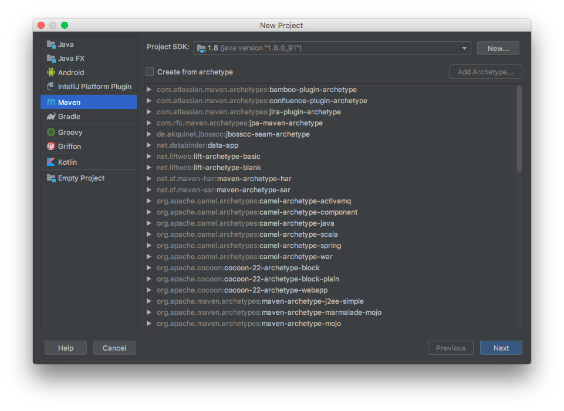
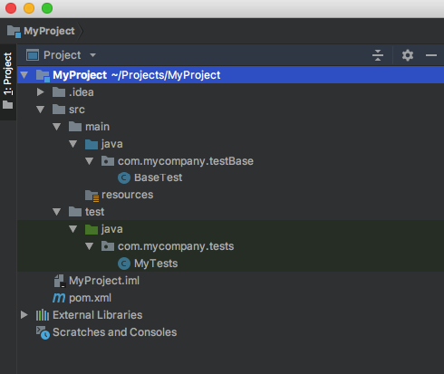
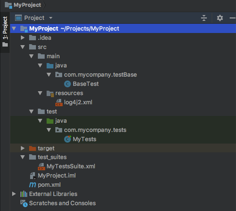
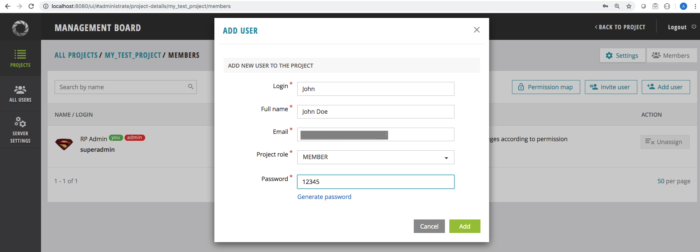
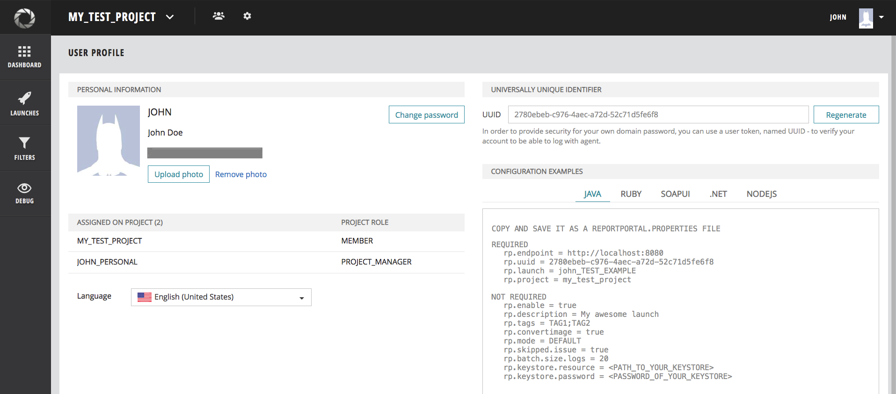
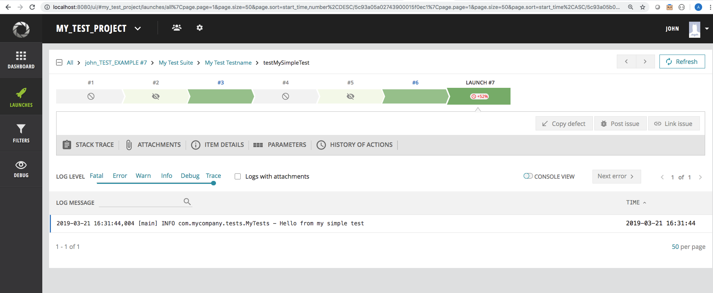

### Integration example TestNG+logback and TestNG+log4j2

Java stack example. 

* contains structure integration - agent. TestNG Listener
* logging integration with LogBack
* screenshot attachement

Download this example with:

```shell
git clone https://github.com/reportportal/example-java-TestNG-logback.git
```

  1. Open `pom.xml` and un-comment 
    - repository
    - dependencies
    - properties - listener
  2. Open `logback.xml` and un-comment 
    - appender RP
    - logger - `binary_data_logger`
    - appender-ref RP
  3. Update `reportportal.properties` file according to you profile page
  4. Navigate to folder with `pom.xml`
  5. call `mvn clean test`


Detailed documentation available here:
  - https://github.com/reportportal/agent-java-testNG
  - http://reportportal.io/docs/Logging-Integration%3Elog4j


## ReportPortal integration with TestNG

This manual will walk you through the steps for integration of Report Portal with TestNG based project

First, make sure you have installed Report Portal, the installation steps could be found [here](http://reportportal.io/docs/Installation-steps)

In this manual we’ll assume that Report Portal is installed and running on <http://localhost:8080>

#### Step 1 - Create new project (Maven)

> If you want to integrate Report Portal with existing project, go to step 3

##### 1.1 Start new maven project



##### 1.2 Enter GroupId and ArtifactId 


##### 1.3 Enter project name


#### Step 2 - Create project structure

Here is an example of the project structure you should have



#### Step 3 - Configure pom.xml

##### 3.1 Add following repository:

```xml
<repositories>
     <repository>
        <snapshots>
          <enabled>false</enabled>
        </snapshots>
        <id>bintray-epam-reportportal</id>
        <name>bintray</name>
        <url>http://dl.bintray.com/epam/reportportal</url>
     </repository>
</repositories>
```

##### 3.2 Add following dependencies:

*The TestNG library*
```xml
<dependency>
    <groupId>org.testng</groupId>
    <artifactId>testng</artifactId>
    <version>6.11</version>
</dependency>
```
*Report Portal agent implementation for TestNG*
```xml
<dependency>
    <groupId>com.epam.reportportal</groupId>
    <artifactId>agent-java-testng</artifactId>
    <version>4.2.1</version>
</dependency>
```
> Latest version of the agent, could be found [here](https://bintray.com/epam/reportportal/agent-java-testng)

##### 3.3 Add Report Portal dedicated logger wrapper  

If you prefer using **Logback** logging library, add following dependencies:

*ReportPortal logback logger dependency*
```xml
<dependency>
    <groupId>com.epam.reportportal</groupId>
    <artifactId>logger-java-logback</artifactId>
    <version>4.0.0</version>
</dependency>
```
> Up to date version could be found [here](https://bintray.com/epam/reportportal/logger-java-logback)

*The logback itself*
```xml
<dependency>
    <groupId>ch.qos.logback</groupId>
    <artifactId>logback-classic</artifactId>
    <version>1.2.3</version>
</dependency>
```

If you prefer using **Log4j** logging library, add following dependencies:

*ReportPortal log4j logger dependency*
```xml
<dependency>
    <groupId>com.epam.reportportal</groupId>
    <artifactId>logger-java-log4j</artifactId>
    <version>4.0.1</version>
</dependency>
```
> Up to date version could be found [here](https://bintray.com/epam/reportportal/logger-java-log4j)

*The log4j itself*
```xml
<dependency>
    <groupId>org.apache.logging.log4j</groupId>
    <artifactId>log4j-api</artifactId>
    <version>2.10.0</version>
</dependency>

<dependency>
     <groupId>org.apache.logging.log4j</groupId>
     <artifactId>log4j-core</artifactId>
     <version>2.10.0</version>
</dependency>
```
##### 3.4 Add `build` section and Maven Surefire plugin

```xml
<plugins>
   <plugin>
       <groupId>org.apache.maven.plugins</groupId>
           <artifactId>maven-surefire-plugin</artifactId>
           <version>2.16</version>
              <configuration>
                <suiteXmlFiles>
                  <xmlFile>test_suites/MyTestsSuite.xml</xmlFile>
                </suiteXmlFiles>
                <properties>
                  <property>
                    <name>usedefaultlisteners</name> <!-- disabling default listeners is optional -->
                    <value>false</value>
                  </property>
                  <property>
                    <name>listener</name>
                    <value>com.epam.reportportal.testng.ReportPortalTestNGListener</value>
                  </property>
                </properties>
               </configuration>
    </plugin>
</plugins>
```
You may also want to use Maven compiler plugin
```xml
<plugin>
  <groupId>org.apache.maven.plugins</groupId>
     <artifactId>maven-compiler-plugin</artifactId>
     <version>3.0</version>
     <configuration>
       <source>1.8</source>
       <target>1.8</target>
      </configuration>
</plugin>
```

#### Step 4 - Add test suite and logger

##### 4.1 Add simple test method

```java
package com.mycompany.tests;

import com.mycompany.testBase.BaseTest;
import org.apache.logging.log4j.LogManager;
import org.apache.logging.log4j.Logger;
import org.testng.annotations.Test;

public class MyTests extends BaseTest {

    private static final Logger LOGGER = LogManager.getLogger(MyTests.class);
    
    @Test
    public void testMySimpleTest() {
        LOGGER.info("Hello from my simple test");
    }
}
```

##### 4.2 Add folder to store TestNG test suites and add xml suite file there

*Example: `./test_suites/MyTestsSuite.xml`*

```xml
<!DOCTYPE suite SYSTEM "http://beust.com/testng/testng-1.0.dtd" >
<suite name="My Test Suite">

    <test name="My Test Testname">
        <classes>
            <class name="com.mycompany.tests.MyTests"/>
        </classes>
    </test>

</suite>
```

##### 4.3 Add `log4j2.xml` file to `resources` folder  
*Example:*
```xml
<?xml version="1.0" encoding="UTF-8"?>
<Configuration status="WARN">
    <Appenders>
        <Console name="ConsoleAppender" target="SYSTEM_OUT">
            <PatternLayout
                    pattern="%d [%t] %-5level %logger{36} - %msg%n%throwable"/>
        </Console>
        <ReportPortalLog4j2Appender name="ReportPortalAppender">
            <PatternLayout
                    pattern="%d [%t] %-5level %logger{36} - %msg%n%throwable"/>
        </ReportPortalLog4j2Appender>
    </Appenders>
    <Loggers>
        <Root level="DEBUG">
            <AppenderRef ref="ConsoleAppender"/>
            <AppenderRef ref="ReportPortalAppender"/>
        </Root>
    </Loggers>
</Configuration>
```
It's needed to add `ReportPortalAppender` into this (as shown in the example)  

By this moment, your project tree should look somewhat like the this:


 
#### Step 5 - Configuring ReportPortal

##### 5.1 Open ReportPortal UI 

Go to *http:$IP_ADDRESS_OF_REPORT_PORTAL:8080* (by default it is *http://localhost:8080*)
  
Login as **Admin** user and create the project (more details [here](http://reportportal.io/docs/Deploy-ReportPortal) and [here](http://reportportal.io/docs/Creation-of-project))


##### 5.2 Add users to your project:

Go to *Administrative* -> *My Test Project* -> *Members* -> *Add user*   
> Example link *http://localhost:8080/ui/#administrate/project-details/my_test_project/members* 



#### Step 6 - Add `reportportal.properties`
Now that you have created new user in your project, you can get `reportportal.properties` file example from the user *Profile* page
 
To do that, login as created user and go to *User icon* in header -> *Profile*  

There, in *Configuration Examples* section, you can find the example of `reportportal.properties` file for that user



Returning back to the code. In your project, create file named `reportportal.properties` in `resources` folder and copy&paste the contents form the user profile page

*Example:*
```properties
rp.endpoint = http://localhost:8080
rp.uuid = 2780ebeb-c976-4aec-a72d-52c71d5fe6f8
rp.launch = john_TEST_EXAMPLE
rp.project = my_test_project
rp.enable = true
```

> More details on `reportportal.properties` file could be found [here](http://reportportal.io/docs/JVM-based-clients-configuration)

#### Step 7 - Add ReportPortal listener

Now we need to add `ReportPortalTestNGListener` to our TestNG tests.

There are multiple ways for doing that:

* method 1 - using @Listeners annotation
* method 2 (maven only) - using `listener` property in Maven Surefire plugin section in `pom.xml`
* method 3 - using `listener` section in xml suite file
* method 4 - using custom runner
* method 5 - using command line
* method 6 - using ServiceLoader
* method 7 (gradle only) - setting listener in Gradle `test` task

> **Note:** To avoid errors and unpredictable results - make sure to use only one method from the list

##### Method 1 - using @Listeners annotation

Add `ReportPortalTestNGListener` to your test class or to the `BaseTest` class, which all your tests are supposed to extend
```java
package com.mycompany.testBase;

import com.epam.reportportal.testng.ReportPortalTestNGListener;
import org.testng.annotations.Listeners;

@Listeners({ReportPortalTestNGListener.class})
public class BaseTest {
    // some base steps for all tests
}
```

> Make sure your test classes extend the `BaseTest` class

##### Method 2 - using `listener` property in Maven Surefire plugin section in `pom.xml` (Maven only)

Add the following property to your Maven Surefire plugin in `build` section of the `pom.xml`

```xml
<configuration>
  <properties>
    <property>
      <name>listener</name>
      <value>com.epam.reportportal.testng.ReportPortalTestNGListener</value>
    </property>
  </properties>
</configuration>
``` 
Pay attention, that if you use this approach, after you run the tests, 
the results will be sent to ReportPortal only if you run the tests via maven (e.g. `mvn clean test`),
that's when the Maven Surefire plugin is being called to run your tests

##### Method 3 - using `listener` section in xml suite file

Add the following code to your TestNG xml suite file (e.g. `./test_suites/MyTestsSuite.xml`)

```xml
<listeners>
        <listener class-name="com.epam.reportportal.testng.ReportPortalTestNGListener" />
</listeners>
```
Pay attention, that if you use this approach, only the results from this suite will be sent to ReportPortal, since the listener is declared only in this suite

*Full xml test suite file:*
```xml
<!DOCTYPE suite SYSTEM "http://beust.com/testng/testng-1.0.dtd" >
<suite name="My Test Suite">
    <listeners>
        <listener class-name="com.epam.reportportal.testng.ReportPortalTestNGListener" />
    </listeners>
    
    <test name="My Test Testname">
        <classes>
            <class name="com.mycompany.tests.MyTests"/>
        </classes>
    </test>
</suite>
```

##### Method 4 - using custom TestNG runner

If you run your tests via custom TestNG runner, you can add listeners to it with the following code:
```java
package com.mycompany.tests;

import com.epam.reportportal.testng.ReportPortalTestNGListener;
import org.testng.*;
import java.util.*;

public class CustomTestNgRunner {

    public static void main(String[] args) {
        ITestNGListener listener = new ReportPortalTestNGListener();
        TestNG testNg = new TestNG();
        List<String> lSuites = new ArrayList<String>();
        Collections.addAll(lSuites, "test_suites/MyTestsSuite.xml");
        testNg.setTestSuites(lSuites);
        testNg.addListener(listener);
        testNg.run();
    }
}
```
##### Method 5 - using command line

Assuming that you have TestNG and ReportPortal client jars in your class path, you can run TestNG tests with ReportPortal listener as follows:

```shell
java org.testng.TestNG ./test_suites/MyTestsSuite.xml –listener com.epam.reportportal.testng.ReportPortalTestNGListener
```

##### Method 6 - using ServiceLoader

With ServiceLoader you can override params in run-time.

*Example of overriding UUID in run-time:*
```java
public class MyListener extends BaseTestNGListener {
    public MyListener() {
        super(Injector.create(Modules.combine(Modules.override(new ConfigurationModule())
                        .with(new Module() {
                            @Override
                            public void configure(Binder binder) {
                                Properties overrides = new Properties();
                                overrides.setProperty(ListenerProperty.UUID.getPropertyName(), "my new uuid");
                                PropertiesLoader propertiesLoader = PropertiesLoader.load();
                                propertiesLoader.overrideWith(overrides);
                                binder.bind(PropertiesLoader.class).toInstance(propertiesLoader);
                            }
                        }),
                new ReportPortalClientModule(),
                new TestNGAgentModule()
        )));
    }
}
```

##### Method 7 - setting listener in Gradle test task (Gradle only)
Assuming that you have the default `test` task in your `gradle.build` file. You can add call of setListeners() methods passing the classpath to `ReportPortalTestNGListener` class

```gradle
test {
    testLogging.showStandardStreams = true // enables test log output to STDOUT
    useTestNG() { // Tells Gradle to use TestNG
        useDefaultListeners = false // Tells TestNG to not use its default reporting structure
        Set listeners = ["com.epam.reportportal.testng.ReportPortalTestNGListener"]
        setListeners(listeners)
        suites 'test_suites/MyTestsSuite.xml' // location of our test suite
    }
}
```

#### Step 8 - Observing test run report

After you added listener using one of the approaches described above, and ran your tests, you should be able to see the results in your ReportPortal instance  
To do that, login to ReportPortal, and go to `Left Panel` -> `Launches`  
You should see the launch there, with the name, which is the `rp.launch` property value from your `reportportal.properties` file  

*Example:* 


You can also see the suites, test classes and individual test results by clicking on the launch name and going deeper



